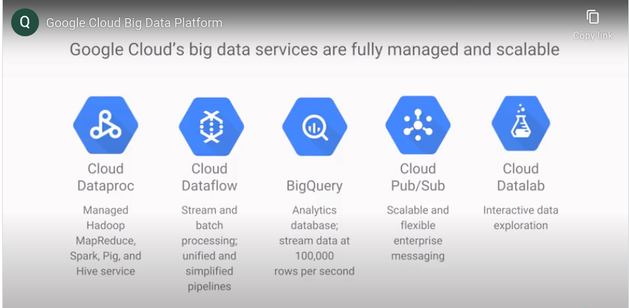
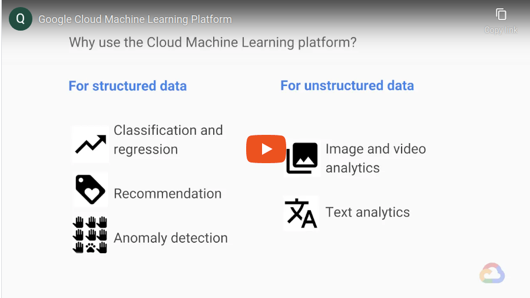

# Big Data and Machine Learning in Cloud

Google Cloud Big Data platform fully managed and scaled. Integrated serverless platform.

## Big Data Services:

    - Dataproc
    - Dataflow
    - BigQuery
    - Pub/Sub 
    - Datalab

### Dataproc

Dataproc is managed Hadoop. Hadoop is open source project invented by Google. It uses MapReduce. Fast, easy and managed way to run. Build in 90 sec or less. Cluster can be scaled up and down. Cluster can be monitored by Stackdriver. Dataproc is built by sec with `1 minute minimum billing`. Batch processig can be done by preempitable instances to reduce cost of compute engine. It's better than On-premise setup. Spark and Spark SQL can be used for data mining, MLlib can be used to identify patterns. It's for known size of data.

### Dataflow

Dataflow is for Realtime data processing. ETL, Batch and Continous computations. It can be used for building data pipeline. Dataflow fully automated. Expressive pipelines can be built and pipelines are auto scaled. It's a general purpose ETL, Fraud detection, Clickstream, Point of Sale, Personalizing Gaming experience. Dynamic pipelines.

## BigQuery

Fully managed, petabyte scale from Google. streams can be ingested in 1 lakhs rows per second. BigQuery uses storage and query services. Region can be specified location(eu, us and asia). Age of data 90 days then google drop the price of search.

### Pub/Sub

Events in realtime it helps to have a messaging services. Pub/Sub for streaming analytics. Pub is sort of Publisher and sub for Subscriber. Application can publish stream and subscribers can recieve messages when published. On demand scalability 1m per sec and beyond. 

### Datalab

Interactive tool for data scientist, BigQuery, Compute Engine and Cloud Storage. 

## Cloud Machine Learning Platform

Google apps uses machine learning. Modern machine learning services with pre-trained models and platform to generate own tailored model. Provides range of servies TensorFlow(for Neural Network developed for Google Brain also takes advantage of TPUs). 

### ML APIs

- Cloud Vision API: to understand content of images and also for clasifications. Sentiment analysis
- Cloud Speech API: Audio to Text
- Cloud Natural Language API: Syntax analysis, Breaking down sentences, relationships among words,flag
- Cloud Translation API : arbitary string translate into destination language.
- 

