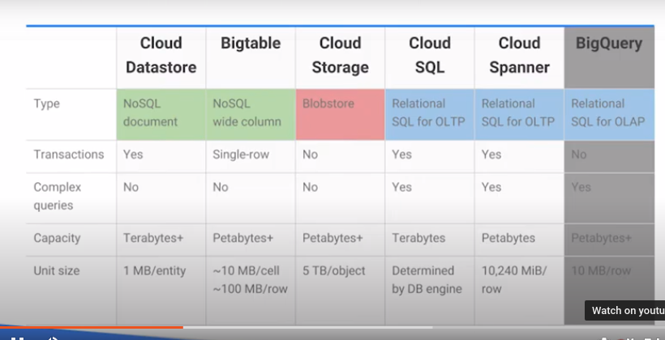
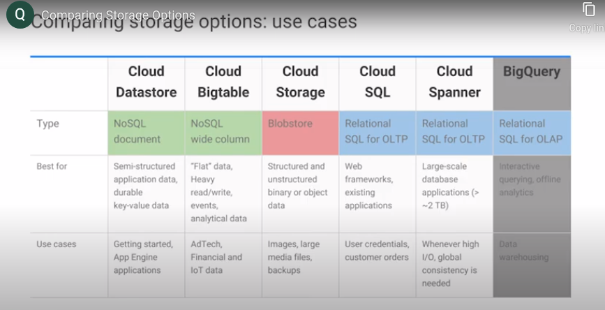

# Cloud Storage
 
 - Cloud Storage is equivalent to AWS S3. All files are stored as Object and can be accessed by URLs. It's not a filesystem.
 - Cloud Storage can be stored and organized in a Bucket. Always encrypts the data at rest. Transfer is through HTTPs.
 - Roles are inherited to buckets and objects.
 - Cloud storage are immutable.
 - Bucket attributes,
 
    - Globally unique name
    - Storage class : 
        - Coldline for archive purpose(old data); accessed once a year
        - Newline for archive purpose(old data); accessed once a month
        - Regional: Accessed within the region
        - Multi-Region: Most frequently accessed.
    - Location
    - IAM policies or ACL
    - Object Versioning : if disabled new object overwrite old one
    - Object Lifecycle management rules - Delete object by date 
    - Upload data to Google Cloud
        - Online transfer : CMD or browser
        - Storage tranfer service :  Batch or scheduled 
        - Transfer Appliance: Leased from Google cloud
    - Cloud Bigtable
      
      NoSQL database service similar to AWS DynamoDB. It is self managed by Google for high availability with low latency, high i/o throughput.
      Hbase API enabled portability with Bigtable. Self managed Hbase is too risky considering availability, scalability. Bigtable handles upgrades, has IAM permission. Bigtable used by Gmail, Search and Analytics. It can be interacted with GCP services or 3rd party service. 
      
      Data can be imported through,
        
          - Applicatio API - Hbase API/ Java Hbase client.
          - Stream - Dataflow, Spark, Storm
          - Batch - Hadoop MapReduce, Dataflow or Spark
          
      Cloud Bigtable as a persistent hashtable - Each item in the database can be sparsely populated, and is looked up with a single key.
      
    - Cloud SQL 
    
      Relational DB service similar to AWS RDS. Supports vertical and horizondal scalabilty. Zonal replication services read and failover, backup with on demand on schedule. Data encryption is supported. 
      Each Cloud SQL database is configured at creation time for either MySQL or PostgreSQL. Cloud Spanner uses ANSI SQL 2011 with extensions.
      
    - Cloud Spanner
      
      Relational DB service similar to AWS RDS. Offers horizontal support, transactional support, replications with throught consistancy. Use case financial and inventory applicaions.
      Cloud Spanner can scale to petabyte database sizes, while Cloud SQL is limited by the size of the database instances you choose. At the time this quiz was created, the maximum was 10,230 GB.
      
     - Cloud Datastore
     
       Similar to Bigtable. Highly scalable. Automatically handles Sharding and Replication. SQL like queries. Free daily quota - Read, Write and Deletes.
       
    - Comparing Cloud Storage
      
      
      
    - Comparing Storage options usecases:
    
      
