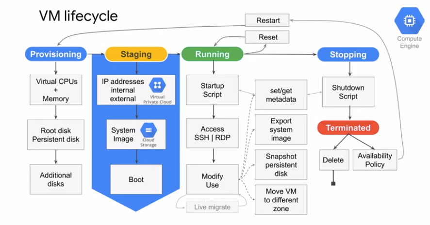
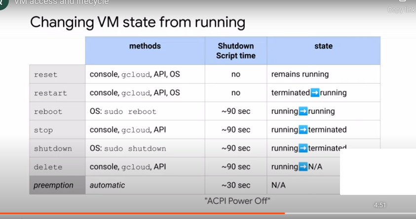

# Virtual Machine(VM)

VM are the most common infrastrucutre component. VM consists of vCPU, Memory, Disk space and Networking. Some of the feature not available in physcial hardware are MicroVM and Burst capabilities.

- Compute Engine
- Compute Options
- Images
- Disk Options

## Compute Engine

It is a Infrastructure as a Service.

- Predefined or custom machine types

    - vCPUs(Core) and Memory(RAM)
    - Persistent disks: HDD (Hard disk drive), SSD(Solid-state Disk), and Local SSD
    - Networking 
    - Linux or Windows

../images/ComputeEngine.png)

Features include:

- Machine rightsizing
- Global load balancing
- Availabiilty policies
- Preempitable

## Compute Options:

Several differnt types 

Choosing Custom type:

    - Choice of CPU will impact the network throughput
    - Specifically network will scale 2GB of throughput per CPU.
    - Except for 2 and 4 CPUs will recieves 10GB throuhput.
    - 32GB of throughput for 16 vCPUs
    - 100GB of throughput for T4 or V100 GPUs
    - A vCPU is equal to 1 hardware hyper-thread

## Storage:

pricing structure will differ

    - Standard/HDD: 
    - SSD: 64 TB / instances. performance depends on space.
    - Local SSD(Better Performance): Higer throughput and lower latency. However the data persist only untill stop or delete instances. 8 seperate 375 GB partition for 3 TB/instances

## Networking:

 - Default, custom network
 - Firewall
 - Load balancers
 - Multi region subnets

## VM access and lifecyle

### Access through console

 Linux

    - SSH
    - Required firewalls to allow SSH, TCP(22) and iCPM

 Windows

    - RDP
    - Required firewalls to allow TCP 3389

### Lifecycle

 

 VM State

 