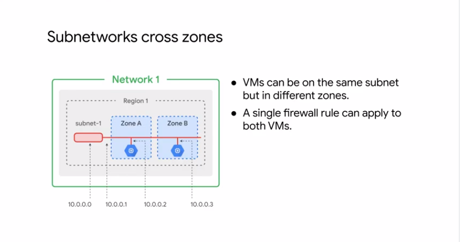

# Virtual Network

## Virtual Private Cloud 

- VPC Objects:

    - Projects
    - Networks
        - Default
        - Auto mode
        - custom mode
    - Subnetworks
    - Region
    - Zone
    - Ip Addresses ranges,
        - Internal
        - External
    - Virtual Machines
    - Routes
    - Firewall rules

### Projects

A key organzier of resources inside GCP. A project associates resources and billing. Contains upto 5 networks that can be shared/peered.

## Network

Do not have IP ranges. Networks are global. Networks can be segregated into sub networks.

Firewall - controll the ingress and exgress port. 

    - Default mode: Every project. Default firewall rules. One subnet per region.
    - Auto mode: The default option. One subnet per region. Regional IP allocation. Fixed 20/subnetworks per region. Expand upto 16/networks
    - Custom mode: No default subnets created. Full control of IP ranges. Regional IP allocation. Expanded to any RFC 1918 size.

### Network Isolate systems

A project with 5 networks. Google edge networks will be used to communicate between different networks. If VMs are in same network there is no need for internet.

#### Subnetworks:

It works on regional scale. Subnet extends across zone's in ther region. 4 IPs are reserverd in the IP range. 1 - networks ; 2- subnet gateways; 3 and last - broadcast address. Single firewall rule can eb applied to the same zone.

- Modification IP will not impact the exsisting VMs. It can be expanded and cannot be shrinked.

Note: Read about subnet IP ranges per /20 /32 /16 /24 .... as per RFC 1918 size

## Ip Addresses

Every mahcine deployed using compute engine will have Internal IP address.

- Internal IP : Assigned via DHCP internally. DHCP lease is renewed 24 hours. App Engine and Kubernetes Engine. Symbolic name is registered with DNS service.  

- External IP : It's optional. Ephimeral(very short) and Reversed(static). Billed if you reserved even if it's not assigned to VM. External address is not known to the VM.

### Mapping IP Addresses

Internal IP addresses: The hostname is same as the instance name. FQDN is [hostname].[zone].c.[project-id].internal. Each instance has a metadata server that acts a DNS resolver for the instances. Route all the local DNS and forwards to Google public DNS if not matched.

External IP addresses: Can allow to hosts outside of the project. User can connect directly with External Ip. DNS can be hosted in Cloud DNS.

Alias IP ranges: Assign a range of internal ip address as aliases to a VM's network interface using alias IP range.

- Cloud DNS: Mananged domain name server with 100% uptime. 

## Routes and firewall rules

By default every n/w has route which send traffic directly to each other even across subnetworks. In addition evey n/w has default routes that directs packets to destination outside the network. A special routes can be created to overrite default route. Firewall rule must allow the packets.

Each route in the route collections may apply to one or more instances. A route apply to instance if a n/w and instance tag matched. If the n/w matches and no instance tag specified, the route applies to all instances in that n/w. Compute engine uses Route collection to create individual read only routing tables for each instance. 

Firewalls - ingress (inbound) and exgress (outbound); Action - allow or deny
When a VM is created the ephemeral external IP address is assigned from a pool. There is no way to predict which address will be assigned, so there is no way to write a rule that will match that VM's IP address before it is assigned. Tags allow a symbolic assignment that does not depend on order in the IP addresses. It makes for simpler, more general, and easier to maintain, firewall rules.
 
## Pricing

## Common Network Design

For availability - Inside the Project -> Network -> Subnetworks -> multiple Zones
For Globailization - Inside the Project -> Network -> Region(s) -> Subnetworks -> multiple Zones

Cloud NAT - Network Address Translation for secured infrastructure, through with all instance can be made private and for internet access Cloud NAT can be leverage to avoid unauthorized access.

Private Google Access - ON: All google API's can be accessed; OFF: All google API's can be accessed only if the VM has public IP address. This setting can be done on Subnet

Cloud IAP(Identity Access Proxy) range - 35.235.240.0/20 CIDR range to be set on Firewall source IP range. cmd: --tunnel-through-iap

